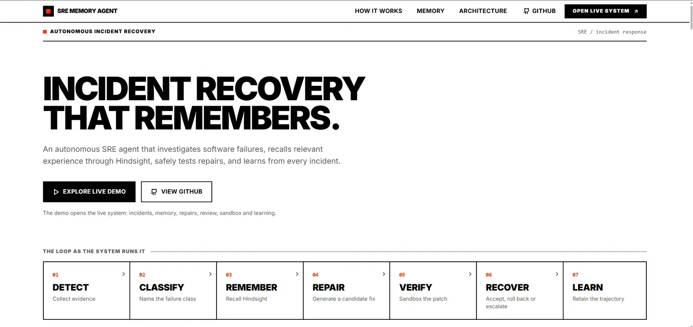
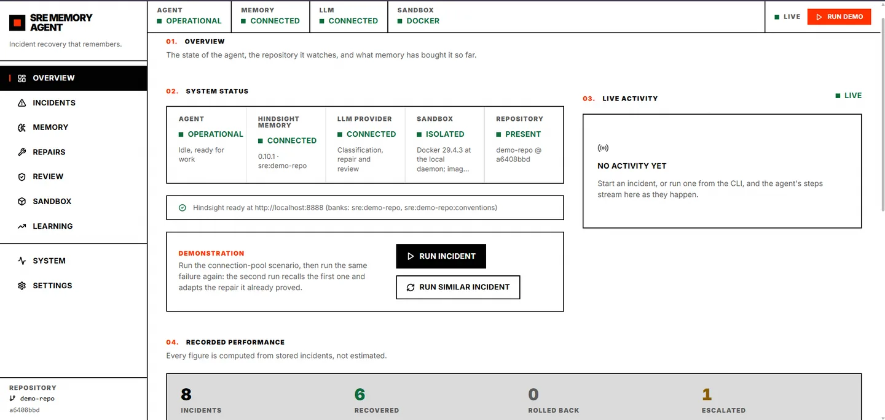
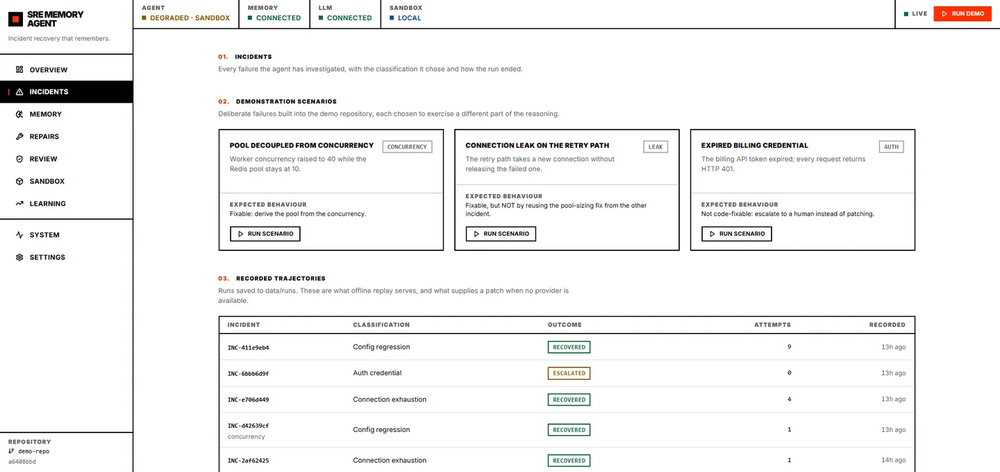
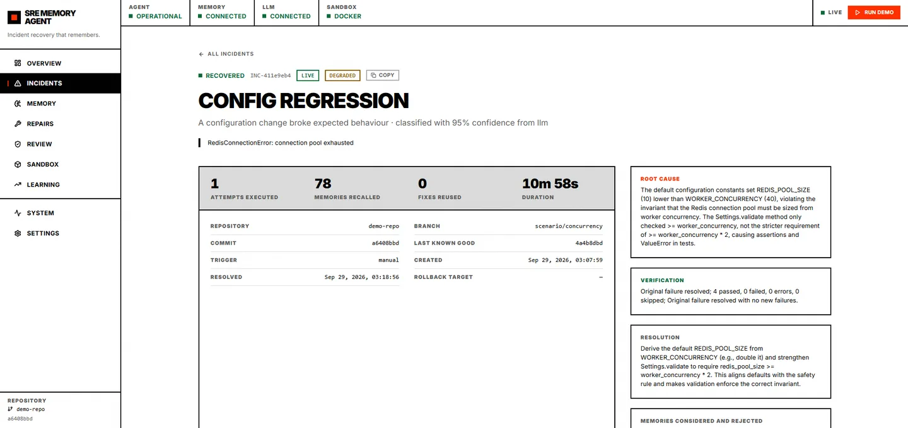
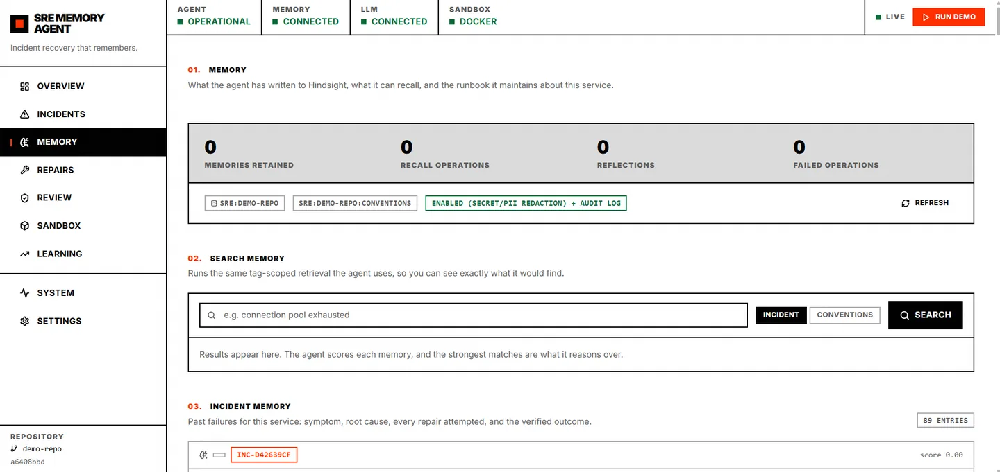
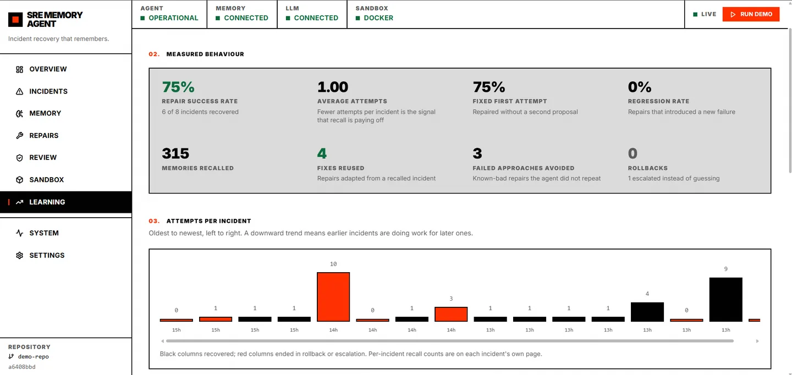

# SRE Memory Agent
## Deployed Live URL: https://huggingface.co/spaces/vssksn/sre-memory-agent
An AI SRE agent that investigates a failing commit, **recalls how it fixed a similar
incident before**, repairs and verifies the change in a sandbox, and writes the whole
incident trajectory back to memory so the next similar failure is cheaper.

Memory is not a feature bolted on here — it is the mechanism that makes the second
occurrence of a failure faster than the first, and the reason the agent refuses to repeat
a fix that already failed.

```
Detect → Classify → Remember → Investigate → Fix → Review → Sandbox Test
       → Verify → Regression Check → Recover → Learn
```

---

## The problem

On-call engineers debug the same class of failure repeatedly, and the knowledge from a
resolved incident evaporates the moment the ticket closes. A CI failure caused by a
configuration change is diagnosed from scratch every time, and a fix that was already
tried and rejected gets proposed again.

This agent keeps an operational memory of incidents — what the symptom was, what the root
cause turned out to be, which repairs were *tried and failed*, and which one was verified —
and uses it on the next failure.

## What it does

1. **Collects evidence** from the real repository and test run: failing tests, stack
   trace, the commit diff against the last known-good commit, changed files, dependency
   changes.
2. **Classifies the failure** into an error taxonomy — and when the failure is one code
   cannot fix (an expired credential, an infrastructure outage), it *escalates instead of
   guessing at a patch*.
3. **Recalls prior incidents** from Hindsight, scoped by error class and component.
4. **Judges comparability.** Recalled memory is evidence, not truth: the same symptom with
   a different underlying cause is refused, and the refusal is explained and shown.
5. **Generates a fix** — complete file contents, never a hand-written diff — and validates
   it deterministically before anything executes.
6. **Review-gates it.** A deterministic policy reviewer (paths, secrets, shell execution,
   test weakening) plus an LLM reviewer checking against **remembered repository
   conventions and previously rejected approaches**. A blocked patch never runs.
7. **Tests it in isolation**: reproduce the failure *unpatched* first, then apply, then
   verify, then run the full suite for regression comparison against a captured baseline.
8. **Recovers or rolls back**, and in *every* terminal state — success, rollback or
   escalation — stores the complete trajectory in Hindsight.

### The three memory loops

| Loop | Hindsight bank | What it holds | Who reads it |
| --- | --- | --- | --- |
| Incident memory | `sre:<repo>` | Evidence → root cause → every attempt incl. failures → verification → outcome | Agent before each repair |
| Convention memory | `sre:<repo>:conventions` | Standing conventions, review findings, rejected approaches | The review gate |
| Runbook (mental model) | `sre:<repo>` | A standing answer to "what are this service's recurring failure modes and which fixes actually worked?" | Agent startup (a plain read — no retrieval, no LLM call), projected to `data/runbook/` |

Storing **failed** approaches is deliberate: knowing that a whole family of fixes does not
work is exactly as valuable as knowing one that does.

---

## Architecture

```
                  ┌────────────────┐
                  │ Git Repository │
                  └────────┬───────┘
                           ↓
              ┌────────────────────────┐      ┌──────────────┐
              │  Failure / CI / test   │      │ FastAPI + UI │
              └───────────┬────────────┘      └──────▲───────┘
                          ↓                          │ SSE
                  ┌────────────────┐                 │
                  │  SRE Agent     │─────────────────┘
                  │  orchestrator  │
                  └───────┬────────┘
     ┌────────────┬───────┴────────┬─────────────┬──────────┐
     ↓            ↓                ↓             ↓          ↓
┌──────────┐ ┌──────────┐  ┌──────────────┐ ┌────────┐ ┌─────────┐
│Classifier│ │   Git    │  │  HINDSIGHT   │ │ Groq   │ │ Policy  │
│ taxonomy │ │ analysis │  │  incidents + │ │  LLM   │ │Reviewer │
└──────────┘ └──────────┘  │ conventions  │ └────────┘ │  (code) │
                           └──────────────┘            └─────────┘
                          ↓
                  ┌────────────────┐
                  │ Fix Generator  │──→ ┌──────────────┐
                  └────────────────┘    │ Review Gate  │
                                        └──────┬───────┘
                                               ↓ approve
                                     ┌──────────────────┐
                                     │ Docker / Local   │
                                     │    Sandbox       │
                                     └────────┬─────────┘
                                              ↓
                              Tests + Regression Check + Rollback
                                              ↓
                                          HINDSIGHT
```

### Project layout

```
src/sre_agent/
  agent/         orchestrator, comparability judge, fix generator, trajectory recorder
  api/           FastAPI app, routes, SSE event broker, application service
  classify/      error taxonomy + classifier (LLM with deterministic fallback)
  llm/           Groq client (structured output, retries, JSON repair) + scripted client
  memory/        Hindsight wrapper: banks, tags, retain/recall/reflect, runbook
  models/        pydantic domain models (Incident, Patch, Attempt, RegressionReport, …)
  patch/         diff generation, validation, application with revert
  review/        deterministic policy reviewer + conventions reviewer
  sandbox/       local and Docker backends + the reproduce/apply/verify/regress flow
  seed/          historical incidents for a warm-bank demo
  tools/         git, pytest runner, evidence collection, regression, rollback, fs utils
  storage.py     SQLite operational record (separate from Hindsight memory)
demo/            the deliberately-broken service the agent repairs (tracked template)
config/          standing repository conventions seeded into convention memory
scripts/         setup, serve, run, verify, seed, Hindsight launcher
tests/           67 tests covering parsing, safety, memory schema and the full loop
web/             React + TypeScript landing page at / and dashboard at /app (built to
                 web/dist, served by FastAPI)
deploy/          deployment targets; currently the Hugging Face Spaces runtime + publisher
```

---

## Setup

Requires Python 3.11+ and a virtual environment.

```bash
# 1. dependencies
venv/Scripts/python.exe -m pip install -r requirements.txt      # Windows
# venv/bin/python -m pip install -r requirements.txt            # macOS / Linux

# 2. configuration
cp .env.example .env      # then paste GROQ_API_KEY (and HINDSIGHT_API_KEY if using Cloud)

# 3. build the demo repository (creates data/demo-repo with 4 scenario revisions)
venv/Scripts/python.exe scripts/setup_demo_repo.py

# 4. run the test suite
venv/Scripts/python.exe -m pytest

# 5. build the sandbox image (optional but recommended)
# Without it the agent runs generated code in a temporary workspace instead of a
# container. The agent reports that fallback as a degradation rather than hiding it.
docker build -f docker/sandbox.Dockerfile -t sre-memory-agent/sandbox:pytest docker/
```

### Environment variables

All configuration is environment-based; nothing is hardcoded. See `.env.example` for the
complete list with comments.

| Variable | Purpose |
| --- | --- |
| `GROQ_API_KEY` | **Required.** LLM for classification, repair generation, review |
| `GROQ_MODEL` / `GROQ_MODEL_FAST` | `openai/gpt-oss-120b` / `openai/gpt-oss-20b` |
| `HINDSIGHT_BASE_URL` | `http://localhost:8888` (embedded/Docker) or `https://api.hindsight.vectorize.io` (Cloud) |
| `HINDSIGHT_API_KEY` | Required for Hindsight Cloud only |
| `MAX_REPAIR_ATTEMPTS` | Repair-attempt budget (default 3). Not a token budget. |
| `REVIEW_BLOCK_SEVERITY` | Severity at which the review gate blocks execution (default `high`) |
| `ALLOWED_PATCH_PATHS` / `FORBIDDEN_PATCH_PATHS` | Deterministic patch scope limits |
| `SANDBOX_BACKEND` | `auto` \| `docker` \| `local` |
| `REQUIRE_APPROVAL_FOR_ROLLBACK` | Gate destructive recovery behind human approval |
| `DEMO_REPLAY_MODE` | Replay recorded trajectories with no network calls |

> Not on a Groq plan that serves `qwen/qwen3-32b`? That model is **not** available on every
> account — check `GET /openai/v1/models`. The client automatically falls back to a known-good
> model and warns loudly rather than failing mid-run.

### Running

```bash
# API + the dashboard at http://127.0.0.1:8000
venv/Scripts/python.exe scripts/serve.py

# one incident from the CLI
venv/Scripts/python.exe scripts/run_incident.py --scenario concurrency

# verify the Hindsight integration on its own
venv/Scripts/python.exe scripts/verify_memory.py
```

### Deploying to Hugging Face Spaces

The public Space (`vssksn/sre-memory-agent`) is a mirror of `main`, published by
`.github/workflows/hf-space-sync.yml`. The workflow builds the dashboard on the runner and
forces a single clean commit onto the Space — the repository history and any generated state
are never published.

| What | Where |
| --- | --- |
| Space runtime image | `deploy/huggingface/Dockerfile` |
| Container entrypoint (env defaults, `/data` storage, demo repo) | `deploy/huggingface/entrypoint.sh` |
| Space card and deployment guide | `deploy/huggingface/README.md` |
| Snapshot publisher | `deploy/huggingface/sync.sh` |

Configure the workflow once: add a **write** token as the `HF_TOKEN` secret, and optionally a
`HF_SPACE` repository variable to override the target Space. To publish from a local checkout
instead:

```bash
cd web && npm ci && npm run build && cd ..
SPACE=vssksn/sre-memory-agent HF_TOKEN=hf_xxx bash deploy/huggingface/sync.sh
```

**The Space runs the memory layer itself.** Because a Space gets one container and no second
host, `entrypoint.sh` starts a Hindsight server alongside the API: `hindsight-all` with
embedded PostgreSQL, its database and embedding-model cache under `/data` so memory survives
a restart. It requires `GROQ_API_KEY`, since Hindsight extracts memories with an LLM (the
image sizes are the cost — that package bundles PostgreSQL and the embedding models).

**The sandbox needs a daemon somewhere, and a Space cannot host one.** Docker-in-Spaces needs
privileged mode or the host socket, and Spaces provide neither, so container isolation comes
from a daemon *elsewhere*: set `DOCKER_HOST` (a Space variable or secret) to reach one over
`ssh://` or TLS, and the sandbox runs generated code in the `sre-memory-agent/sandbox:pytest`
container on that daemon. Build the image there once —
`docker build -f docker/sandbox.Dockerfile -t sre-memory-agent/sandbox:pytest docker/`.

Because that daemon cannot see the Space's filesystem, the workspace is **streamed** into the
container and extracted into an ephemeral `tmpfs` mount rather than bind-mounted: a bind mount
against a remote daemon resolves to a path that does not exist over there, so the container
would test an empty directory and report failures that say nothing about the code. With no
`DOCKER_HOST`, the agent falls back to the local temporary-workspace backend and the dashboard
reports the missing container isolation as a degradation — it never calls that isolation.

Without `GROQ_API_KEY` the demo falls back to re-rendering recorded trajectories, which the UI
marks `simulated`.

---

## The landing page

The public page is served at `/`. It explains the mechanism — the problem, the ten-step loop,
what memory changes, what happens when a repair fails, the architecture and the safety
principles — and then hands the visitor to the application.

It is **not** a second dashboard and it carries no sample data. The panels that look like
screenshots are the product: the capability strip, the instance counters, the memory records,
the latest incident's diff and its test reports are all rendered from the running deployment
through the same API and, where it applies, the same components the dashboard uses. Where
there is nothing to show — an empty bank, no incidents yet, an unreachable API — the page says
so rather than inventing a figure. The page renders without the API at all, so an unreachable
backend never blocks the front door.

It also carries a slideshow of six real captures of the dashboard, labelled by route — see
[Screenshots](#screenshots).

```
/                    the public landing page
/app                 the dashboard (Overview)
/app/incidents       history and scenarios
/app/incidents/:id   one investigation, as a numbered timeline
/app/memory          both Hindsight banks, search, conventions, runbook
/app/repairs         patches, diffs, review and regression outcomes
/app/review          the review gate's findings
/app/sandbox         reproduce-before-patch evidence
/app/learning        attempts per incident over time
/app/system          dependencies, degradation modes, raw event stream
/app/settings        the configuration the backend is running with
```

The routes the dashboard answered before it moved (`/incidents`, `/incidents/:id`,
`/memory`, …) redirect to their `/app` equivalents, so an incident link shared last week still
opens the same incident. `/landing` also redirects to `/`.

The copy lives in `web/src/lib/site.ts`, including the repository link every "View GitHub"
affordance reads — set `VITE_GITHUB_URL` to override it, or to an empty string to hide every
source link rather than point at a repository that does not exist.

## Screenshots

Nothing below is a mock-up. Each image is a capture of the running dashboard, labelled with the
route it was taken from; the figures in them belong to the run that produced them, which is why
they are labelled rather than presented as live. The landing page shows the same six as a
slideshow.

### `/app` — Overview



*Dependency health, the recorded performance figures, the latest incident and the live activity
stream. Every figure is computed from stored incidents — there are no estimates anywhere.*

### `/app` — system status



*Hindsight memory, the LLM provider, the sandbox and the repository, each with the reason it is
limited when it is. A sandbox running outside a container is reported as a missing guarantee,
not folded into one unexplained “degraded”.*

### `/app/incidents` — history and scenarios



*The three demonstration scenarios, the recorded trajectories available for replay, and the full
history with search, outcome filter and sort.*

### `/app/incidents/:id` — one investigation



*One incident as a numbered timeline — detected, classified, remembered, compared, repaired,
reviewed, sandboxed, regression-checked, recovered, learned — with the real evidence behind each
step. This is the screen that makes the design legible: a failed attempt stays in the timeline.*

### `/app/memory` — what the agent remembers



*Both Hindsight banks, tag-scoped search, the conventions the review gate enforces, and the
runbook the agent maintains for itself.*

### `/app/learning` — whether effort is falling



*Attempts per incident over time, recall versus reuse, and whether the effort each incident costs
is falling as memory fills. A falling attempts line with a rising reuse count is the whole thesis
of the project in one screen.*

**Where the files live, and how a Space gets them.** The optimised files are committed under
`web/public/screenshots/` — six WebP images, about 285 KB in total, from 3.2 MB of raw PNG. A
Hugging Face Space does not carry binaries, so `deploy/huggingface/sync.sh` strips them from the
published snapshot and the workflow builds the dashboard with `VITE_SCREENSHOT_BASE` pointing at
this repository, which is where the Space then loads them from (the repository has to be public
for an anonymous `raw.githubusercontent.com` read). Set `PUBLISH_SCREENSHOTS=1` to publish them
with the Space instead. The landing page reads its own `/screenshots` directory
first, falls back to the repository, and drops a slide it cannot load rather than showing a
broken image.

**Re-capturing them**, with the API running (`python scripts/serve.py`):

```bash
# 1. capture (Chrome is driven over the DevTools Protocol; no extra dependency is installed)
cd web && node scripts/capture-screenshots.mjs --out ../screenshots --width 1917 --height 907

# 2. optimise to WebP and the published names
cd .. && venv/Scripts/python.exe scripts/optimize_screenshots.py screenshots web/public/screenshots
```

The capture script writes one file per view and refuses to report success on a page that rendered
nothing; `--views repairs,sandbox` re-shoots a subset. The optimiser derives each output name from
the capture's file name, and takes `--rename FROM=TO` for files that arrive with another name —
as the first four did, having come from a browser download as `image.png`, `image copy.png`, and so
on. A capture of a page whose selected incident has repairs is one `--views` flag away; the
`repairs`, `review`, `sandbox`, `system` and `settings` screens are all in the script's view list.

## The dashboard

A React + TypeScript interface, built to `web/dist` and served by FastAPI at the same origin,
so there is one process and one URL. Ten sections, every one reading live API data:

| Section | What it shows |
| --- | --- |
| Overview | Dependency health, recorded performance, the latest incident, live activity |
| Incidents | The demonstration scenarios, recorded trajectories, and the full history with search, filter and sort |
| Incident detail | The investigation as a numbered timeline — detect, classify, recall, comparability, each repair attempt, review, sandbox, regression, recovery, learning — with the real evidence behind every step |
| Memory | Both Hindsight banks, tag-scoped search, the conventions the review gate uses, and the service runbook |
| Repairs | Each patch, its diff, resulting file contents, validation, review and regression outcome |
| Review | The gate: deterministic policy findings separated from memory-informed ones, with the rule each finding cites |
| Sandbox | Reproduce-before-patch evidence, before/after test counts, and the isolation the run had |
| Learning | Attempts per incident over time, recall-versus-reuse, and whether effort per incident is falling |
| System | Every dependency, its degradation mode, and the raw event stream |
| Settings | The configuration the backend is actually running with, plus memory seeding and record clearing |

```bash
cd web
npm install
npm run dev      # http://localhost:5173, proxying /api to 127.0.0.1:8000
npm run build    # writes web/dist, which FastAPI then serves at /
```

### Design decisions worth knowing

**The visual language is Swiss International style**: a strict grid, one accent colour
(`#FF3000`) used only to signal, black borders instead of shadows, zero border radius, and
heavy uppercase grotesque typography. Hierarchy comes from type scale and white space rather
than from cards and fills, and depth comes from CSS pattern overlays (24px grid, dot matrix,
diagonal, noise) rather than from shadows. Nothing is rounded or glowing.

**Functional status colours are the one deliberate extension.** The style forbids extra colour,
but an SRE tool has to show success, warning and failure at a glance, so three desaturated
values were added and red was kept for failure — the same job it does as the accent. Colour is
never the only signal: every status also carries a word.

**Three common dependencies were deliberately not used.**

- *shadcn/ui*: its defaults (rounded corners, soft shadows, muted palettes) fight the style on
every component, so the primitives are written directly against the design tokens.
- *Framer Motion*: the style calls for instant, mechanical transitions, which CSS does in
  ~180ms. A JavaScript animation runtime would add weight for motion that is intentionally
  not springy, and `prefers-reduced-motion` is honoured in CSS alone.
- *Recharts*: the meaningful quantities here are counts and pass/fail totals, which read better
  as large figures and small proportional bars. A charting library would have been 100KB to
  draw what a bordered `div` draws exactly. Where a series genuinely matters — attempts per
  incident — it is drawn as labelled columns from real values.

**Nothing is fabricated.** There are no placeholder pages and no invented numbers. Where the API
cannot supply a figure the interface says so; where a run was degraded or replayed, the page says
that too. Per-incident recall counts are shown on the incident page rather than in the list,
because the list API does not carry them. The landing page follows the same rule in the places
where a screenshot would be easier: it renders the real memory records, the real patch diff and
the real test reports, and states plainly when a deployment has none yet.

---

## The demo

`scripts/setup_demo_repo.py` builds a small delivery-worker service with a git history
containing three real, independently fixable failures:

| Scenario | Branch | Failure | Expected agent behaviour |
| --- | --- | --- | --- |
| Pool sizing | `scenario/concurrency` | Worker concurrency raised to 40; Redis pool hardcoded at 10 | Repairs it: derive the pool from the concurrency |
| Connection leak | `scenario/leak` | The retry path takes a new connection without releasing the failed one | **Same error class, different root cause** — a recalled pool-sizing fix must be *refused* |
| Expired credential | `scenario/auth` | Billing API token expired (HTTP 401) | Escalates: no patch is attempted |

The leak scenario is the one that matters. It fails with the same
`RedisConnectionError: connection pool exhausted` message as the first, so a memory agent
that blindly replays its previous fix gets it wrong. The suite even contains an assertion
(`client.in_use == 0`) that resizing the pool cannot satisfy, so only a correct fix passes.

**Suggested demo flow**

1. Run `scenario/concurrency` on a cold bank → watch it investigate, repair and verify.
2. Run `scenario/leak` → watch recall fire, then watch the agent **refuse** the recalled
   fix because the root causes differ, and generate a fresh one.
3. Run `scenario/auth` → watch it decline to patch code and escalate instead.
4. Compare attempts-to-fix and wall-clock between the runs.

Every run is recorded to `data/runs/<incident_id>.json`. `--offline` replays the **real**
LLM outputs (patch, review verdict, comparability judgement) from a recorded run, so a
demo needs no provider at all once one live run exists per scenario:

```bash
venv/Scripts/python.exe scripts/run_incident.py --scenario concurrency          # live, records
venv/Scripts/python.exe scripts/run_incident.py --offline --scenario concurrency # replays it
```

Nothing is fabricated: if no recorded trajectory contains a patch, offline mode says so
and refuses to invent one. Runs are labelled `simulated`/`REPLAY` when replayed.

---

## API

| Method | Path | Purpose |
| --- | --- | --- |
| GET | `/api/health`, `/api/status` | Dependencies, banks, sandbox backend, warnings |
| GET | `/api/metrics` | Dashboard aggregates + learning statistics |
| GET | `/api/incidents`, `/api/incidents/{id}` | History and full incident detail |
| POST | `/api/incidents` | Start an incident run (`{"scenario": "leak"}`) |
| GET | `/api/stream` | Server-Sent Events: the live agent trajectory |
| GET | `/api/memory`, `/api/memory/search` | Browse what the agent remembers |
| GET | `/api/memory/runbook` | The self-maintained runbook |
| GET | `/api/conventions` | Standing conventions in convention memory |
| POST | `/api/memory/seed` | Seed a warm bank (idempotent) |
| GET | `/api/demo/scenarios` | Available scenarios + recorded runs |
| POST | `/api/incidents/{id}/rollback/approve` | Approve a gated rollback |

---

## Safety

The agent never executes arbitrary shell against production.

* Generated code runs **only** in a sandbox: a container with no network, memory/CPU/PID
  caps and a non-root user (`docker/sandbox.Dockerfile`), or — when no Docker daemon answers
  or that image is missing — a temp workspace on the host. The container may run on any
  daemon `DOCKER_HOST` names, local or remote (`SANDBOX_COPY_REPO`, on by default, streams
  the workspace in for daemons that cannot see this filesystem; a remote daemon forces it).
  Which one is in force is always reported: the dashboard shows `Isolated` or `Local
  fallback`, the status strip names the missing guarantee (`DEGRADED · SANDBOX`), and the
  card quotes the reason the sandbox itself gives — an unexplained "degraded" is
  indistinguishable from a broken agent. The local fallback still degrades the overall agent
  status, because container isolation is part of what this agent guarantees about code it
  wrote itself. The image is also checked for the ability to run pytest, so a tag that exists
  but cannot run this project's suites is reported as a misconfiguration instead of surfacing
  as broken code.
* Patches are validated deterministically before execution: path allowlist and denylist,
  traversal rejection, size caps, secret detection.
* A review gate blocks execution on critical findings — hardcoded credentials, shell
  execution, destructive SQL/filesystem operations, skipped tests, tautological assertions.
* The failure is reproduced **unpatched** before a fix is trusted; a fix cannot be
  "verified" by a test run that executed nothing.
* Rollback is a reviewed, audited plan, optionally gated behind administrator approval.
* Hindsight **Memory Defense** is enabled on the memory banks (secret/PII redaction plus an
  audit log), because the inputs are production logs and stack traces.
* Degradation is never hidden: if Hindsight or the sandbox is unavailable, the incident is
  marked `degraded` with the reason, and replayed runs are labelled `simulated`.

---

## Testing

```bash
venv/Scripts/python.exe -m pytest                  # full suite
venv/Scripts/python.exe -m pytest -m "not slow"    # skip the end-to-end runs
```

Covers pytest-output parsing (including the "nothing ran" case that must never look
green), patch validation, the review gate's decisions, regression comparison and flake
separation, the Hindsight tag/recall schema, classification and escalation rules, and a
full end-to-end incident loop against the demo repository using a scripted LLM.

---

## Implementation status

Implemented and verified end to end: evidence collection, classification with escalation,
fix generation, deterministic + LLM review gating, sandbox execution (reproduce → apply →
verify → regress), regression protection, rollback with an approval gate, the full Hindsight
memory layer (banks, policy, tags, retain, recall, reflect, runbook mental model),
convention memory, trajectory record/replay, seeding, SQLite persistence, the FastAPI
service with SSE, and the CLI tools.

**The public page and the dashboard are built** (`web/`): the landing page at `/`, the
dashboard under `/app`. Both read live API data everywhere — no mock JSON, no fake metrics —
and the production build passes (`npm run build`), with per-page code splitting so the first
paint carries only the shell.

**Verified against a real Hindsight server** (Docker, `ghcr.io/vectorize-io/hindsight`):
bank creation, Memory Defense (`action=redact`, confirmed by reading the bank config back),
the audit log, retain, tag-scoped recall with real relevance scores, the conventions bank,
and the runbook mental model. A live incident run recalled prior memories and stored its own
trajectory; `reflect` is the one operation the free-tier Groq plan cannot serve — see
`HINDSIGHT.md` for the measurements and the options. Note that the repair loop itself uses
retain and recall only, so the free-tier ceiling does not block the agent's learning.

---

## Further reading

* `PROJECT.md` — the full design: loop, error taxonomy, review gate, demo script
* `HINDSIGHT.md` — verified Hindsight SDK behaviour, the tag/recall schema, and the
  notes on running Hindsight locally against a free Groq plan
* `HACKATHON.md` — the event brief and content submission requirements
